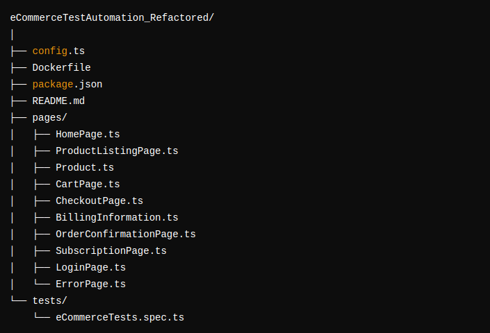
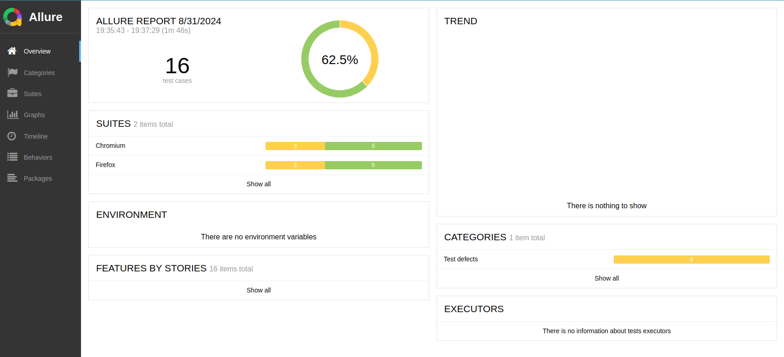

# eCommerce Test Automation Project

This project contains automated tests for an eCommerce application using Playwright, TypeScript, and the Page Object Model (POM) design pattern.

## Project Structure

- **pages/**: Contains the Page Object classes.
- **tests/**: Contains the test scripts.
- **config.ts**: Centralized configuration for selectors, credentials, and URLs.
- 

## Prerequisites

- Docker
## Allure Reports


## Setup

### 1. Build the Docker Container

```bash
docker build -t ecommerce-test-automation .

## 2. Run the Tests
To run the tests inside the Docker container:
docker run --rm ecommerce-test-automation

3. Generate Allure Report
To generate the Allure report:

docker run --rm -v $(pwd)/allure-results:/app/allure-results -v $(pwd)/allure-report:/app/allure-report ecommerce-test-automation allure generate allure-results --clean -o allure-report


4. View Allure Report
To view the Allure report:
docker run --rm -p 4040:4040 -v $(pwd)/allure-report:/app/allure-report allure-framework/allure serve -p 4040 allure-report


Writing Tests
Tests are located in the tests/ directory.
Each test uses the Page Object Model to interact with the application.
Running Tests
To run all tests: docker run --rm ecommerce-test-automation

